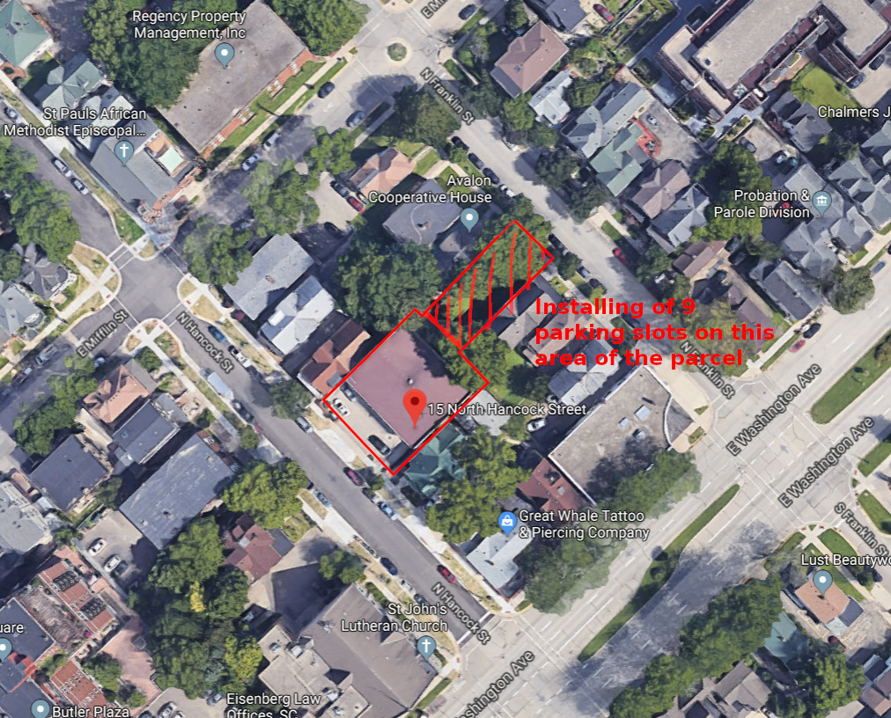
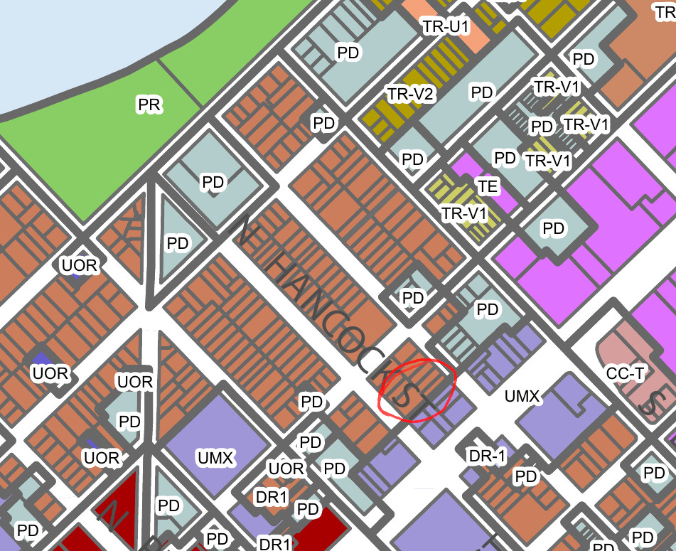
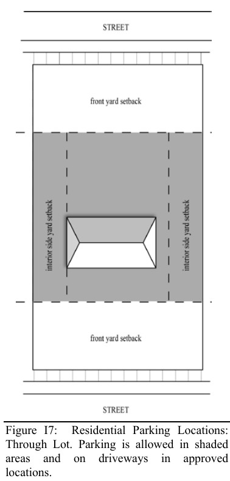
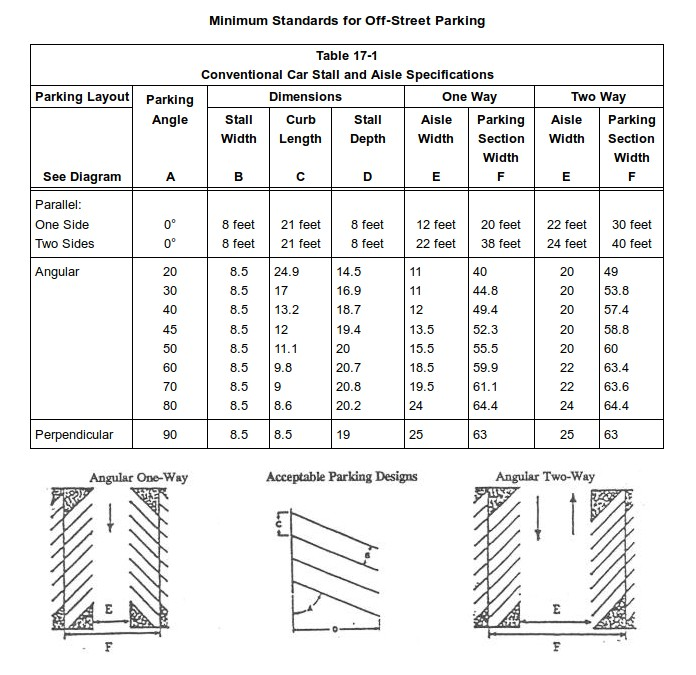
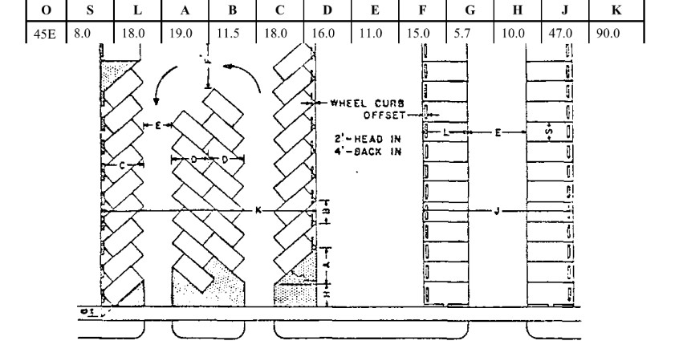

### Code research for 15N Hancock St, Madison

* Purpose: Build 9 parking slots on the N Franklin side of the parcel
* Zone: **DR1** (Downtown Residential 1)

#### From Madison Zoning code, chapter 28E (Downtown Residential Areas):

* Sec 28.071(3)(a) - Parking:

    1. Parking shall be located in parking structures, underground, or in surface parking lots behind principal buildings. Parking structures shall be designed with liner buildings or with ground floor office or retail uses along all street-facing facades.

    2. **For corner lots or through lots, rear yard surface parking areas abutting any street frontage are limited to fifty percent (50%) of that frontage, and shall be located a minimum of ten (10) feet from the street property line.**

    3. Parking garage openings visible from the sidewalk shall have a clear maximum height of sixteen (16) feet and a maximum width of twenty-two (22) feet. Garage doors or gates shall be located a minimum of ten (10) feet from the front property line. Doors to freight loading bays are exempt from this requirement.

    4. No doors or building openings providing motor vehicle access to structured parking or loading facilities shall face State Street, King Street, or the Capitol Square.

* Sec. 28.074(4) - Design review:

    (a) Minor exterior changes or additions may be approved by the Director of the Department of Planning, Community, and Economic Development if he/she determines that the changes or additions are compatible with the existing design or consistent with the Downtown Urban Design Guidelines.

    (b) All new buildings and additions that are less than twenty-thousand (20,000) square feet and are not approved pursuant to (a) above, as well as **all major exterior alterations to any building** shall be approved by the Urban Design Commission based on the design standards in Sec. 28.071(3), if applicable, and the Downtown Urban Design Guidelines. The applicant or the Alderperson of the District in which the use is located may appeal the decision of the Urban Design Commission to the Plan Commission.

* Sec. 28.078 -  Downtown residential 1 district:

    1. Permitted and Conditional Uses. See Table 28E-2 for a complete list of allowed uses within the downtown and urban districts.
    2. Dimensional Standards. Standards represent minimums unless otherwise noted. Dimensions are in feet unless otherwise noted:

    Lot area (sq. ft.) : 3,000
    Lot width: 1, 2, and 3-unit dwellings: 30 > 3-unit dwellings, and non-residential and mixed-use buildings: 40
    **Front yard setback: 15** See (a) below
    Side yard setback: 5 Lot width <40: 10% lot width
    Rear yard setback: Lesser of 20% lot depth or 30 See (b) below
    **Maximum lot coverage:  75%**
    Maximum height: See Downtown Height Map
    Stepback:  See Downtown Stepback Map
    **Usable open space: 40 sq. ft. per bedroom** See (c) below

    (a) Front yard setbacks may be designated on the zoning map as a specific location (build to line), a minimum, or a range.

    (b) Underground parking may extend into the rear yard setback if located completely below grade.

    (c) Usable open space may take the form of at-grade open space, porches, balconies, roof decks, green roofs or other above-ground amenities.

* Sec. 28.140(1) - Usable open space

    Usable open space shall be provided on each lot used in whole or in part for residential purposes, as set forth in each district

    (a)  Usable open space at ground level shall be in a compact area of not less than two hundred (200) square feet, with no dimension less than eight (8) feet and no slope grade greater than ten percent (10%). 1.  Where lot width is less than forty (40) feet, the minimum dimension of usable open space may be reduced to six (6) feet.

    (b) Usable open space shall not include areas occupied by buildings, driveways, drive aisles, off-street parking, paving and sidewalks, except that paved paths no wider than five (5) feet, and pervious pavement designed for outdoor recreation only may be included as usable open space.

    (c)  Within the Central Area, as defined, where usable open space requirements cannot be met due to limited existing lot area, or building/parking placement, required landscaped areas may be used to meet the usable open space requirement, provided that said landscaped areas are a minimum of five (5) feet in width.

* Sec. 28.141(4)(g) - Table 28I-3. Off-Street Parking Requirements

    Multi-family dwelling: Minimum 1 per dwelling, maximum 2.5 per dwelling, minimum bicycles 1 per unit up to 2-bedrooms, 1⁄2 space per add’l bedroom; 1 guest space per 10 units

* Sec. 28.141(8) - Residential parking design and location

    1. Parking is not permitted within front yard setbacks, or any street side yard setback, including the side yard setback extension into the rear yard, except on a driveway meeting the standards of Subsection (9) below.

    2. Parking shall not be located on street terraces, driveways, or any other areas located within a public right-of-way not explicitly designated by the Director of Public Works.

    3. Parking spaces may be located within: a.  an interior side yard setback. b. a rear yard setback, except as in sub. 1 above. (Am. by ORD-14-00133, 8-13-14) c. the building envelope.

    4. **Parking on a Through Lot. Through lots are defined as having two (2) front yards and no rear yard. Parking on a through lot may be located within the building envelope, or an interior side yard setback, but not in either front yard setback.**

    5. **A maximum of forty percent (40%) of the front and rear yard setbacks may be paved and used for driveway and parking purposes provided lot coverage requirements are not exceeded.**

    Landscaping and Screening. All off-street parking areas shall be landscaped according to the standards of Sec. 28.142, with the exception of parking for single-family detached, two-family and three-family dwellings.

* Sec. 28.141(9) -  Residential Driveway Design and Location

    (a) **Driveways shall be a minimum of eight (8) feet in width**, except where otherwise
    specified in Sec. 10.08, MGO.

    (b) **Driveways may be located in the following locations: 1. Within a front yard setback** or street side yard setback, including the extension of the side yard setback into the rear yard setback (see Figures I8 and I9). The driveway must lead only from a street to the nearest garage or to a parking area located in compliance with Subsection (8)(c) above. Maximum driveway width is the width of the garage entrance or parking area, up to a maximum of twenty-two (22) feet. 2. Driveways leading to an attached or detached garage at a single- or two-family dwelling may be located in the front setback area and be wider than the width of the garage entrance if the driveway width extension meets the following standards (see Figure I17): i. The total width of the driveway and driveway width extension in the
    front yard setback does not exceed twenty (20) feet. ii. The  total depth of the driveway including the driveway width extension shall be no less than eighteen (18) feet, and no vehicle parked in the driveway shall extend over or otherwise obstruct any portion of the public right-of-way. iii The driveway width extension shall only project toward the nearest interior side lot line, beyond the exterior side wall of the garage structure. iv. Access to the driveway and driveway width extension shall be no wider than the width of the driveway and driveway width extension at the sidewalk or street property line.

    (c) Two (2) driveways may be constructed within a front yard setback or, on a corner lot, within the street side yard setback, including the extension of the side yard setback into the rear yard setback, if the following standards are met (see Figure I10): 1. Each driveway is a maximum of eleven (11) feet wide, or ten (10) feet within an interior side yard setback. 2. Both driveways meet at a point outside the required front, street side or side yard extension setbacks. 3.  Both driveways lead to the same garage or to the same paved or graveled parking area located in compliance with Subsection (8)(c) above.

    (d) Two (2) driveways may be constructed to serve twin dwellings (two-family dwellings separated by a common wall). Each dwelling may have one (1) driveway that meets the requirement of par. (c) above, with a maximum width equal to the width of the garage entrance or parking area, not to exceed twenty-two (22) feet.

    (e) A maximum of two (2) curb cuts are permitted for any residential lot.

    (f) Driveways may be shared between two single- or two-family lots, provided that appropriate easements or other agreements are established. Shared driveways shall meet the minimum and maximum width requirements of this section.

    (g) Driveways shall be oriented in a perpendicular fashion to the street from which they take access, and shall cross required setbacks in a perpendicular fashion, to the extent feasible.

    (h) Driveways serving commercial or industrial uses shall not cross residentially-zoned properties, except where allowed by conditional use.

* Sec. 28.142(4) - Landscape Plan and Design Standards

    Landscape Calculations and Distribution: Required landscaped areas shall be calculated based upon the total developed area of the property. Developed area, for the purpose of this requirement, is defined as that area within a single contiguous boundary which is made up of structures, parking, driveways and docking/loading facilities, but excluding the area of any building footprint at grade, land designated for open space uses such as athletic fields, and undeveloped land area on the same zoning lot. (a) Five (5) landscape points shall be provided for each three hundred (300) square feet of developed area.

### From International Building Code ICC 2015

* Chapter 8 / section 801 - Parking

    https://codes.iccsafe.org/content/IZC2015/chapter-8-general-provisions?site_type=public
    
    Minimum width: 9ft (8ft for compact stalls)
    Minimum length: 20ft (18ft for compact stalls)
    
### Angular stalls dimensioning

    https://www.codepublishing.com/WA/MillCreek/html/MillCreek17/MillCreek1727.html
    
    For 45 degrees stalls:
    
    Stall width: 8.5ft
    Stall depth: 19.4ft
    Aisle width: 13.5ft

### Areas computing

    http://www.cityofmadison.com/assessor/property/propertydata.cfm?ParcelN=070913320043
    Terrain area:  10692 sqft
    Max coverage: 75% x 10692 sqft = 8019 sqft
    Current coverage: 6890 sqft (estimate existing) + 2739 sqft (projected) = 9629 sqft

#### From Madison zoning code, chapter 10 - Parkings

* Sec. 10.08(1)(q)(2) - Number of Entrances

(a) A maximum of two (2) entrances shall be permitted to a residential site provided that where a single off-street parking facility shall serve more than one residential site no more than two (2) entrances shall be permitted to such a facility.

(c) When in the opinion of the Traffic Engineer, after hearing the views of the permittee, it is in the interests of good traffic operation, the Traffic Engineer may permit: 1. One (1) additional driveway entrance along a continuous site frontage in excess of six hundred (600) feet or two (2) additional driveway entrances along a
continuous site frontage in excess of twelve hundred (1,200) feet. 2. One (1) additional entrance from each of not more than two (2) abutting streets where continuous frontage is less than six hundred (600) feet; provided that such additional entrances be used exclusively as a service drive for the purpose of loading or unloading materials or merchandise, and which drive is physically separated from other off-street vehicle facilities and not available to customers thereof through the use of a six-inch (6”) high raised rolled asphalt or poured in place concrete curb or a guardrail erected eighteen (18) inches in height to the
center measured from the paved parking surface. 3. One (1) or two (2) driveway entrances from additional abutting streets.

* Sec. 10.08(1)(q)(3) - Location of Entrances

(b) No entrance shall be closer than five (5) feet to an adjacent property line; provided, however, that in cases of practical difficulty or unnecessary hardship the City Engineer, Traffic Engineer and Director of the Building Inspection Division may jointly reduce such requirement with subsequent appeal to the Board, if necessary. No driveway approach shall be so constructed that any part of the same extends in front of property belonging to a person other than the permittee unless both property owners sign a joint application for a permit. (Am. by Ord. 8081, 7-29-83; ORD-08-00109, 10-7-08)

Maximum permitted width of entrance ........................................................ 20 feet
Minimum permitted width of entrance ........................................................... 8 feet
Maximum permitted width of driveway ....................................................... 20 feet
Minimum permitted width of driveway .......................................................... 8 feet

